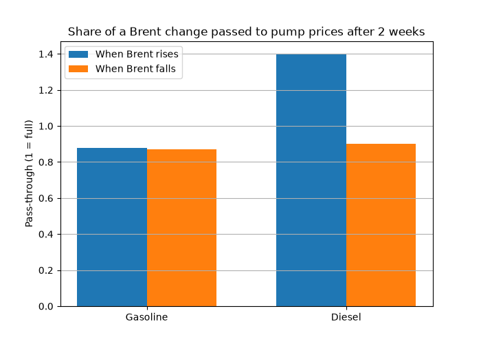

# Fuel Prices in Portugal vs Brent Crude

How do Portuguese pump prices for gasoline and diesel respond to international oil prices —
and do they rise faster than they fall ("rockets and feathers")?

## Key findings
- On average since 2019, taxes make up 49% of the price of a litre of diesel in Portugal.
- **Gasoline shows no asymmetry:** after two weeks, 88% of a Brent rise and 87% of a Brent fall reach the pump price (p = 0.95).
- **Diesel shows a "rockets and feathers" pattern:** a 1-cent rise in Brent raises the pre-tax diesel price by about 1.4 cents within two weeks, while a 1-cent fall lowers it by only about 0.9 cents. The difference is statistically significant (p = 0.001) and remains so with autocorrelation-robust (HAC) standard errors (p = 0.03).
- Most of the adjustment happens in the same week; rises keep being passed through in the following week, falls do not.
- Part of this asymmetry likely comes from refining margins: diesel margins widened sharply during the 2022 and 2026 oil price spikes, so the result does not by itself show higher retail margins.

## What makes up the price of a litre

## Rockets and feathers

## Data sources
- **Brent crude oil price** (USD/barrel) — FRED, series DCOILBRENTEU
- **EUR/USD exchange rate** — FRED, series DEXUSEU
- **Portuguese pump prices with and without taxes** — European Commission, Weekly Oil Bulletin

## Method
1. Brent converted to euros per litre and averaged by week.
2. Pump prices matched to the previous week's Brent price.
3. Price split into oil cost, margin and taxes.
4. Regression of weekly price changes (without taxes) on Brent rises and falls, this week and last week.
5. Robustness check with HAC (Newey-West) standard errors, allowing for autocorrelation of up to 4 weeks.

## Limitations
- Brent is used as a proxy for the product cost; the "margin" therefore also includes refining margins.
- National weekly averages hide differences between stations and brands.
- Asymmetry alone does not prove anti-competitive behaviour (stocks and consumer search costs can explain it).

## Project structure
    data/raw/         original data, never edited by hand
    data/processed/   cleaned data produced by the notebooks
    notebooks/        analysis, run in order (01, 02)
    figures/          charts used in this README

## How to run
    python -m venv .venv
    .venv\Scripts\activate
    pip install -r requirements.txt