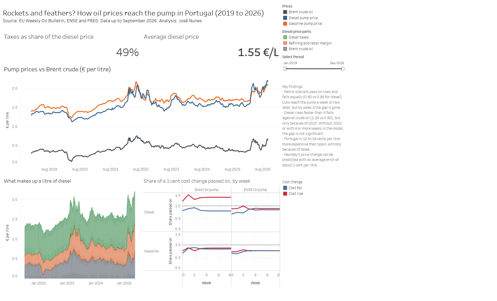
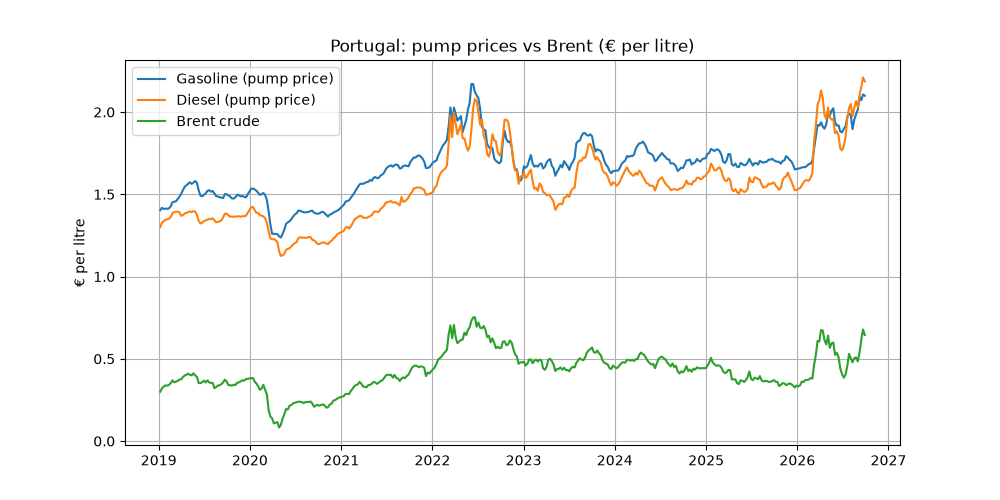
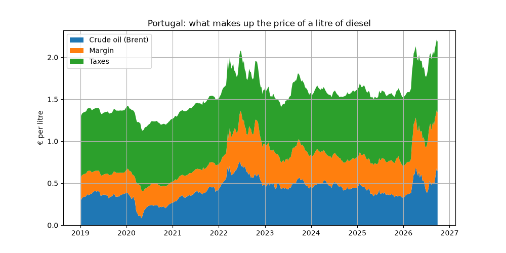
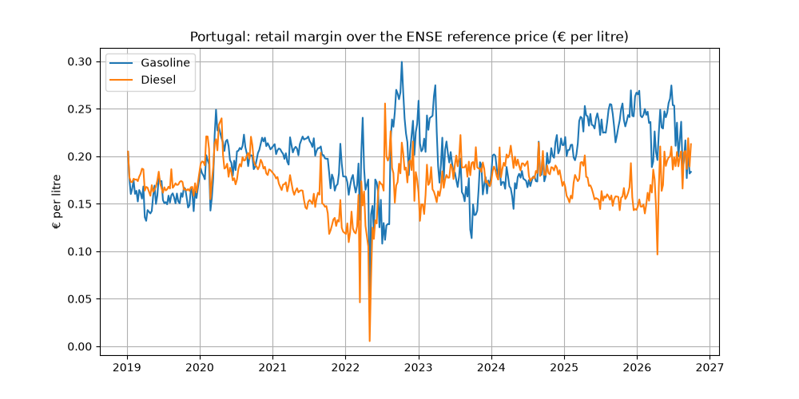
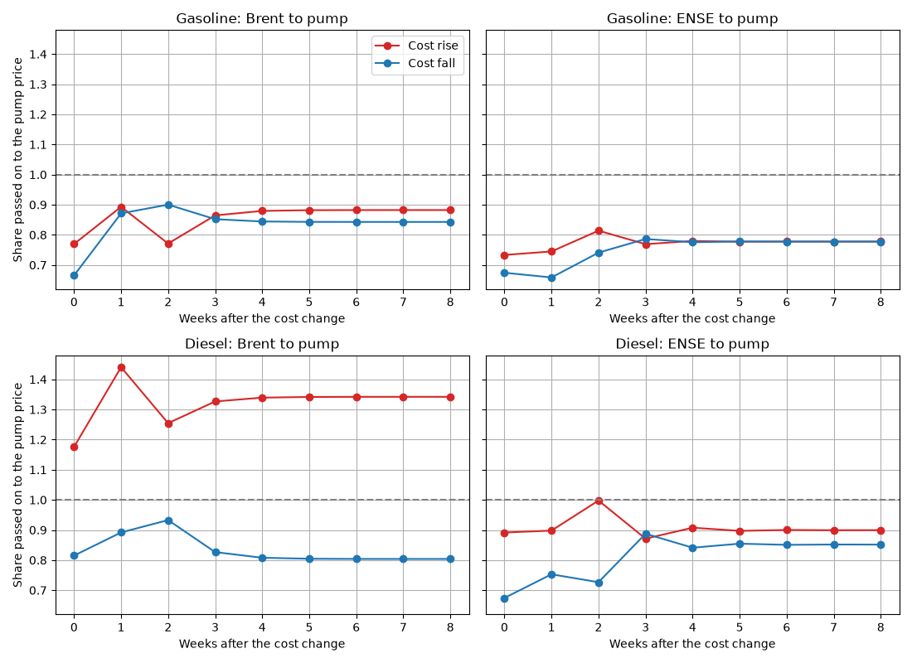
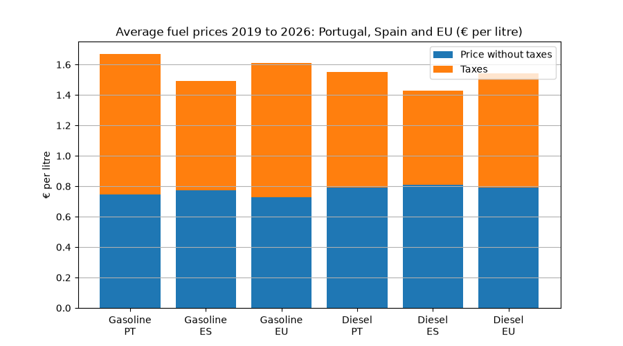
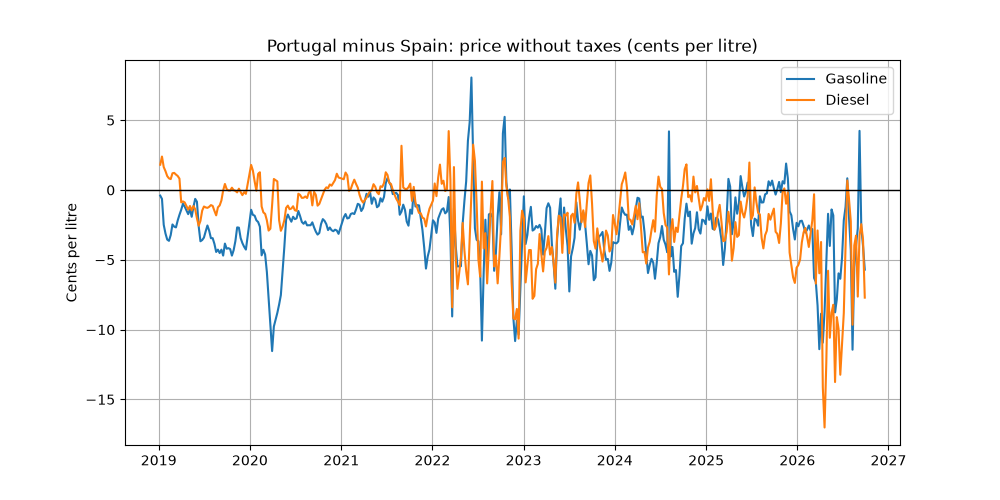
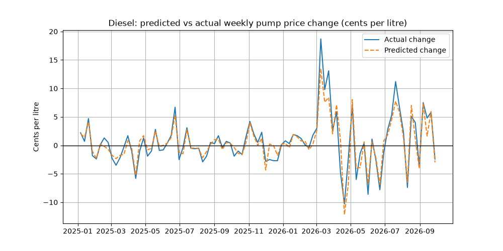

# Rockets and Feathers? How Oil Prices Reach the Pump in Portugal

I started this project with a simple question: when oil prices go up, do Portuguese pump prices go up faster than they come down when oil gets cheaper? People call this "rockets and feathers". If it happens, I wanted to know where: at the petrol stations, or earlier, in refining and wholesale. Along the way I also compared Portugal with Spain and tried to predict next Monday's price change.

The data is weekly, from January 2019 to September 2026.

**[Interactive dashboard on Tableau Public](https://public.tableau.com/app/profile/jos.nunes7914/viz/FuelpricesinPortugalvsBrent/Fuelpricesdashboard)**

## What I found

Short answer: petrol stations in Portugal pass on cost increases and decreases in the same way. Against the ENSE reference price, a 1 cent rise in the cost raises the diesel pump price by 0.90 cents in the long run, and a 1 cent fall lowers it by 0.85 cents. The difference is not significant (p = 0.37). For gasoline it is 0.78 in both directions. Price cuts do take a week or two longer to show up at the pump, but after about three weeks there is no gap left.

The only place where I found something that looks like rockets and feathers is diesel against crude oil: 1.34 cents for a rise in Brent against 0.80 for a fall (p = 0.047). But this comes from 2022. When I take that year out, the difference is no longer significant (p = 0.29). It also goes away if the model allows 4 or more weeks for prices to adjust, so I would not read much into it. In 2022 refined diesel became much more expensive than crude oil after the sanctions on Russia, and that gap took a long time to close.

Comparing Brent with the ENSE reference price, the numbers suggest that if there is an asymmetry, it happens in refining and wholesale (1.48 vs 1.06 for diesel). The evidence is weak, though (p = 0.18), so I would not claim more than that.

There is also something I did not expect. With an error correction model, when the diesel pump price is above its usual level compared with the reference price, half of that gap disappears in about 2 weeks. When it is below its usual level, it takes about 16 weeks to recover (p = 0.04). In other words, unusually high margins do not last, while squeezed margins take months to come back. That is the opposite of rockets and feathers.

A few other results:
- Taxes are about half of what you pay: 49% of the price of a litre of diesel on average since 2019.
- The retail margin (pump price minus reference price, VAT on the margin included) is around 20 cents per litre for gasoline and 17 cents for diesel. In spring 2022 the diesel margin dropped almost to zero.
- Fuel in Portugal costs 17.6 cents per litre more than in Spain for gasoline and 12.3 cents more for diesel. All of that gap is taxes. Before taxes, Portugal is actually 2 to 3 cents cheaper.
- Last week's change in the ENSE reference price predicts Monday's pump price change with an average error of about 1 cent per litre (0.88 for gasoline, 1.06 for diesel). I tested it on 2025 and 2026, which the model never saw. It gets the direction right in 86% of weeks for gasoline and 90% for diesel.

## Pump prices vs Brent

## What makes up the price of a litre

## Retail margins

## Rockets and feathers, week by week
This chart shows how much of a 1 cent rise (red) or a 1 cent fall (blue) in the cost reaches the pump price in each week after the change. If the red line climbed faster and higher than the blue one, that would be rockets and feathers. Against the ENSE reference price, both lines end up in the same place.

## Portugal vs Spain vs EU

## Forecasting Monday's pump price change

I estimated the model on 2019 to 2024 and tested it on 2025 and 2026. To check that it is actually useful, I compared it with two simple rules: assuming the price does not change, and assuming the pump moves exactly as much as the reference price did last week.

| Fuel | Test weeks | Error, model (cents) | Error, "no change" (cents) | Error, "copy the reference price" (cents) | Right direction |
|---|---|---|---|---|---|
| Gasoline | 91 | 0.88 | 1.96 | 1.25 | 85.7% |
| Diesel | 91 | 1.06 | 3.02 | 1.19 | 90.1% |

The model beats both rules. The gain is clear for gasoline and smaller for diesel, where simply copying the reference price already works quite well. The model does well in normal weeks but misses part of the biggest shocks, like the jump in diesel prices in March 2026.

## Data
- Brent crude oil price (USD per barrel): FRED, series DCOILBRENTEU
- EUR/USD exchange rate: FRED, series DEXUSEU
- Portuguese pump prices with and without taxes: European Commission, Weekly Oil Bulletin
- Reference prices for gasoline and diesel: ENSE (Entidade Nacional para o Setor Energético). They are published daily and include international quotes for refined products, biofuels, logistics and taxes, but not the retail part (distribution to stations, margin and the VAT on them)

## Method
1. I converted Brent to euros per litre and took weekly averages.
2. Portuguese pump prices change on Mondays based on the previous week's quotes, so each Monday price is matched to last week's costs.
3. I split the price into oil cost, margin and taxes.
4. Pass-through is measured with an asymmetric distributed lag model, estimated by OLS with Newey-West standard errors (4 lags).
5. I ran it for three steps of the price chain: Brent to the pump price (without taxes), Brent to the ENSE reference price, and the ENSE reference price to the pump price (with taxes).
6. As robustness checks, I ran everything again without 2022 and with 1 to 6 weeks of lags.
7. The week by week chart above comes from the estimated coefficients.
8. Finally, an asymmetric error correction model (Engle and Granger two step method) measures how fast prices go back to their usual level.

## Econometric specification

The weekly change in the pump price depends on rises and falls in the cost, this week and in the three weeks before, plus last week's price change:

$$\Delta p_t = \alpha + \sum_{k=0}^{3} \beta_k^{+} \Delta c_{t-k}^{+} + \sum_{k=0}^{3} \beta_k^{-} \Delta c_{t-k}^{-} + \rho \, \Delta p_{t-1} + \varepsilon_t$$

Here $\Delta c^{+}$ keeps only cost increases and $\Delta c^{-}$ only decreases. The long run pass-through is

$$LR^{+} = \frac{\sum_{k} \beta_k^{+}}{1-\rho} \qquad LR^{-} = \frac{\sum_{k} \beta_k^{-}}{1-\rho}$$

and symmetry is tested with an F-test of $H_0: \sum_k \beta_k^{+} = \sum_k \beta_k^{-}$.

## Results

| Cost measure | Fuel | LR rises | LR falls | F statistic | p-value | R² | N |
|---|---|---|---|---|---|---|---|
| Brent | Gasoline | 0.88 | 0.84 | 0.03 | 0.863 | 0.53 | 391 |
| Brent | Diesel | 1.34 | 0.80 | 3.96 | **0.047** | 0.60 | 391 |
| ENSE reference | Gasoline | 0.78 | 0.78 | 0.00 | 0.999 | 0.71 | 391 |
| ENSE reference | Diesel | 0.90 | 0.85 | 0.81 | 0.368 | 0.83 | 391 |

The ENSE reference price explains much more of the weekly changes in pump prices than Brent does (R² of 0.71 and 0.83 against 0.53 and 0.60), which makes sense, since it is closer to what stations actually pay. One more detail: last week's price change has a positive effect against Brent (prices keep adjusting the week after) and a negative one against the reference price (part of the previous change gets corrected).

### Where in the chain, and what happens without 2022

| Sample | Fuel | Step | LR rises | LR falls | p-value |
|---|---|---|---|---|---|
| Full sample | Gasoline | Brent to pump | 0.88 | 0.84 | 0.863 |
| Full sample | Gasoline | Brent to ENSE | 0.99 | 1.10 | 0.722 |
| Full sample | Gasoline | ENSE to pump | 0.78 | 0.78 | 0.999 |
| Full sample | Diesel | Brent to pump | 1.34 | 0.80 | **0.047** |
| Full sample | Diesel | Brent to ENSE | 1.48 | 1.06 | 0.179 |
| Full sample | Diesel | ENSE to pump | 0.90 | 0.85 | 0.368 |
| Without 2022 | Gasoline | Brent to pump | 0.65 | 0.74 | 0.732 |
| Without 2022 | Gasoline | Brent to ENSE | 0.85 | 0.96 | 0.745 |
| Without 2022 | Gasoline | ENSE to pump | 0.74 | 0.80 | 0.405 |
| Without 2022 | Diesel | Brent to pump | 1.08 | 0.78 | 0.291 |
| Without 2022 | Diesel | Brent to ENSE | 1.25 | 1.04 | 0.468 |
| Without 2022 | Diesel | ENSE to pump | 0.92 | 0.83 | 0.118 |

Only one result is significant, diesel from Brent to the pump, and it goes away once 2022 is excluded. Values above 1 against Brent are not a mistake: taxes and refining margins also move with the oil price. What matters for the test is the difference between rises and falls.

### How many weeks of lags?

The main model uses this week and the three weeks before. To check that this choice does not drive the results, I ran it again with 1, 2, 3, 4 and 6 weeks, always on the same weeks so the AIC can be compared (lower AIC means a better balance between fit and number of terms). The table shows the p-value of the symmetry test.

| Fuel | Step | 1 week | 2 weeks | 3 weeks | 4 weeks | 6 weeks |
|---|---|---|---|---|---|---|
| Gasoline | Brent to pump | 0.93 | 0.86 | 0.86 | 0.66 | 0.21 |
| Gasoline | Brent to ENSE | 0.51 | 0.47 | 0.74 | 0.97 | 0.91 |
| Gasoline | ENSE to pump | 0.37 | 0.58 | 1.00 | 0.65 | 0.52 |
| Diesel | Brent to pump | 0.06 | 0.09 | 0.05 | 0.21 | 0.45 |
| Diesel | Brent to ENSE | 0.31 | 0.37 | 0.19 | 0.51 | 0.79 |
| Diesel | ENSE to pump | **0.01** | **0.01** | 0.36 | 0.66 | 0.80 |

Two things stand out. Diesel against Brent is only close to significant with 3 weeks or fewer. And diesel from the reference price to the pump looks asymmetric with 1 or 2 weeks, because price cuts take a week or two longer to reach the pump and a short model stops counting before they have fully arrived. With 3 weeks or more the difference disappears, and the AIC prefers 4 to 6 weeks for this step. So stations are slower to pass on cuts, but in the end they pass on the same amount.

### Error correction model

I first estimate the long run relationship between the pump price and the reference price in levels. Then I add last week's distance from that relationship to the weekly model, separately for when the price is above and below its usual level:

$$\Delta p_t = \ldots + \theta^{+} \, gap^{+}_{t-1} + \theta^{-} \, gap^{-}_{t-1} + \varepsilon_t$$

A negative $\theta$ means the price moves back towards its usual level. The half life is how many weeks it takes to close half of the gap.

| Fuel | Long run slope | Cointegration p-value | θ above | θ below | Half life above (weeks) | Half life below (weeks) | p-value, same speed |
|---|---|---|---|---|---|---|---|
| Gasoline | 0.96 | 0.092 | -0.002 | -0.129 | not measurable | 5.0 | 0.244 |
| Diesel | 0.98 | **0.015** | -0.308 | -0.041 | 1.9 | 16.4 | **0.042** |

In the long run, pump prices follow the reference price almost one to one. For diesel, a price above its usual level comes back within about 2 weeks, while a price below it takes about 16 weeks. For gasoline I cannot tell the two speeds apart. I only report this model against the reference price: against Brent there is no stable long run relationship (cointegration p-values of 0.14 and 0.49), again because refining margins change so much over time.

<b>Full regression tables</b> (coefficients with HAC standard errors in parentheses)

Significance: *** p < 0.01, ** p < 0.05, * p < 0.1

**Against Brent** (dependent variable: weekly change in the pump price without taxes)

| Variable | Gasoline | Diesel |
|---|---|---|
| Cost rise, week t | 0.770*** (0.113) | 1.176*** (0.161) |
| Cost rise, week t-1 | 0.001 (0.116) | 0.058 (0.172) |
| Cost rise, week t-2 | -0.142 (0.111) | -0.232** (0.108) |
| Cost rise, week t-3 | 0.113 (0.114) | 0.105 (0.136) |
| Cost fall, week t | 0.665*** (0.091) | 0.815*** (0.110) |
| Cost fall, week t-1 | 0.100 (0.111) | -0.067 (0.115) |
| Cost fall, week t-2 | -0.004 (0.083) | 0.027 (0.102) |
| Cost fall, week t-3 | -0.053 (0.094) | -0.114 (0.101) |
| Price change, week t-1 | 0.159** (0.074) | 0.176** (0.089) |
| Constant | 0.000 (0.001) | -0.003* (0.001) |
| Observations | 391 | 391 |
| R² | 0.53 | 0.60 |

**Against the ENSE reference price** (dependent variable: weekly change in the pump price with taxes)

| Variable | Gasoline | Diesel |
|---|---|---|
| Cost rise, week t | 0.733*** (0.062) | 0.892*** (0.071) |
| Cost rise, week t-1 | 0.185** (0.074) | 0.263*** (0.081) |
| Cost rise, week t-2 | 0.072 (0.066) | 0.102** (0.044) |
| Cost rise, week t-3 | -0.028 (0.037) | -0.098** (0.038) |
| Cost fall, week t | 0.674*** (0.043) | 0.674*** (0.053) |
| Cost fall, week t-1 | 0.144* (0.076) | 0.273*** (0.075) |
| Cost fall, week t-2 | 0.079* (0.043) | -0.004 (0.058) |
| Cost fall, week t-3 | 0.065 (0.050) | 0.153** (0.065) |
| Price change, week t-1 | -0.237*** (0.072) | -0.288*** (0.066) |
| Constant | 0.001 (0.001) | 0.000 (0.001) |
| Observations | 391 | 391 |
| R² | 0.71 | 0.83 |

Notebook 02 also has a simpler first version of the model, with two weeks of adjustment and no momentum term.

## Limitations
- Brent leaves out refining margins, so results against Brent mix retail behaviour with the refining market. That is why I also use the ENSE reference price.
- The ENSE reference price is a benchmark built from international quotes and standard costs, not what each company really pays.
- The retail margin includes distribution, station costs and the VAT on them, so it is not profit.
- National weekly averages hide differences between stations and brands.
- Some weeks are missing in the Oil Bulletin, so a few price changes cover two or three weeks.
- The forecast uses the latest published ENSE prices, which can be revised, so in real time it would be slightly less accurate.
- The diesel error correction result is close to the 5% line and may be driven partly by the long margin squeeze of 2022.

## Project structure
    data/raw/         original data, never edited by hand
    data/processed/   cleaned data and results produced by the notebooks
    notebooks/        analysis, run in order (01 to 06)
    figures/          charts used in this README

## How to run
    python -m venv .venv
    .venv\Scripts\activate
    pip install -r requirements.txt

Then run the notebooks in order: 01_brent.ipynb, 02_fuel_prices.ipynb, 03_ense_reference.ipynb, 04_portugal_vs_eu.ipynb, 05_monday_forecast.ipynb, 06_extensions.ipynb.

## References
- Bacon, R. W. (1991). Rockets and feathers: the asymmetric speed of adjustment of UK retail gasoline prices to cost changes. *Energy Economics*, 13(3), 211 to 218.
- Borenstein, S., Cameron, A. C. and Gilbert, R. (1997). Do gasoline prices respond asymmetrically to crude oil price changes? *Quarterly Journal of Economics*, 112(1), 305 to 339.
- Engle, R. F. and Granger, C. W. J. (1987). Co-integration and error correction: representation, estimation, and testing. *Econometrica*, 55(2), 251 to 276.
- Meyer, J. and von Cramon-Taubadel, S. (2004). Asymmetric price transmission: a survey. *Journal of Agricultural Economics*, 55(3), 581 to 611.
- Newey, W. K. and West, K. D. (1987). A simple, positive semi-definite, heteroskedasticity and autocorrelation consistent covariance matrix. *Econometrica*, 55(3), 703 to 708.

**Data**
- FRED, Federal Reserve Bank of St. Louis: [DCOILBRENTEU](https://fred.stlouisfed.org/series/DCOILBRENTEU) and [DEXUSEU](https://fred.stlouisfed.org/series/DEXUSEU)
- European Commission, [Weekly Oil Bulletin](https://energy.ec.europa.eu/data-and-analysis/weekly-oil-bulletin_en)
- ENSE, [Preços de referência](https://www.ense-epe.pt/precos-de-referencia/)

*Personal project built with public data only. The views are my own and do not represent ERSE.*