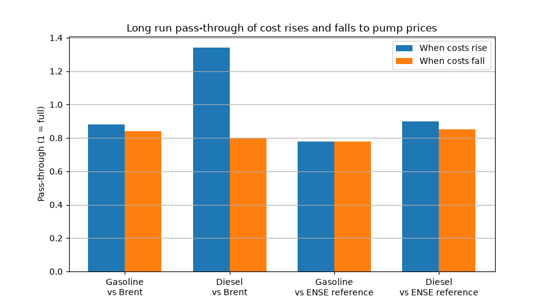

# Fuel Prices in Portugal vs Brent Crude

How do Portuguese pump prices for gasoline and diesel respond to oil prices, and do they rise faster than they fall ("rockets and feathers")?
And if they do, is it the petrol stations or the refining and wholesale market?

**[Open the interactive dashboard on Tableau Public](https://public.tableau.com/app/profile/jos.nunes7914/viz/FuelpricesinPortugalvsBrent/Fuelpricesdashboard)**

## Key findings
- **Diesel rises faster than it falls against crude oil:** in the long run, a 1 cent rise in Brent raises the pre-tax diesel price by about 1.34 cents, while a 1 cent fall lowers it by only 0.80 cents (p = 0.047).
- **But not against the wholesale reference price:** using the ENSE reference price (based on international quotes for refined products), diesel rises and falls are passed on almost equally (0.90 vs 0.85, p = 0.37).
- **So the diesel asymmetry comes from refining and wholesale markets, not from petrol stations.**
- **Gasoline shows no asymmetry** against either cost measure.
- Retail margins (pump price minus reference price) average about 20 cents per litre for gasoline and 17 cents for diesel. The diesel margin was squeezed close to zero during the spring 2022 price spike, and the gasoline margin stayed clearly above the diesel margin in 2025 and 2026.
- On average since 2019, taxes make up 49% of the price of a litre of diesel.

## Pump prices vs Brent

## What makes up the price of a litre

## Retail margins

## Rockets and feathers

## Data sources
- **Brent crude oil price** (USD per barrel): FRED, series DCOILBRENTEU
- **EUR/USD exchange rate**: FRED, series DEXUSEU
- **Portuguese pump prices with and without taxes**: European Commission, Weekly Oil Bulletin
- **Reference prices for gasoline and diesel** (daily, with taxes, without retail costs and margin): ENSE, Entidade Nacional para o Setor Energético

## Method
1. Brent converted to euros per litre and averaged by week, from January 2019 to September 2026.
2. Pump prices matched to the previous week's costs, since Portuguese prices adjust weekly based on last week's quotes.
3. Price split into oil cost, margin and taxes.
4. Regression of weekly pump price changes on cost rises and cost falls, this week and in the previous three weeks, plus last week's pump price change (price momentum).
5. Long run pass-through calculated as the sum of the cost effects divided by one minus the momentum effect, and an F-test of whether rises and falls are passed on equally. Standard errors are HAC (Newey-West) with 4 lags.
6. The test is run twice: against Brent (pump prices without taxes) and against the ENSE reference price (both with taxes).

Notebook 02 also includes a simpler first version of the model, with two weeks of adjustment and no momentum term.

## Limitations
- Brent does not include refining margins, so results against Brent mix retail behaviour with the refining market. The ENSE test addresses this.
- The ENSE reference price is a benchmark based on international quotes and standard costs, not the actual purchase cost of each company.
- The retail margin includes distribution, station costs and VAT on them, so it is not the same as profit.
- National weekly averages hide differences between stations and brands.
- A few weeks are missing in the Oil Bulletin data, so a small number of price changes cover two or three weeks.

## Project structure
    data/raw/         original data, never edited by hand
    data/processed/   cleaned data and results produced by the notebooks
    notebooks/        analysis, run in order (01, 02, 03)
    figures/          charts used in this README

## How to run
    python -m venv .venv
    .venv\Scripts\activate
    pip install -r requirements.txt

Then run the notebooks in order: 01_brent.ipynb, 02_fuel_prices.ipynb, 03_ense_reference.ipynb.